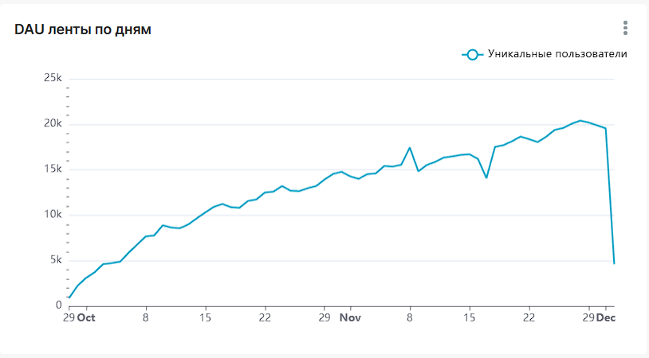
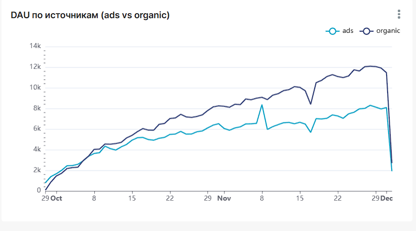
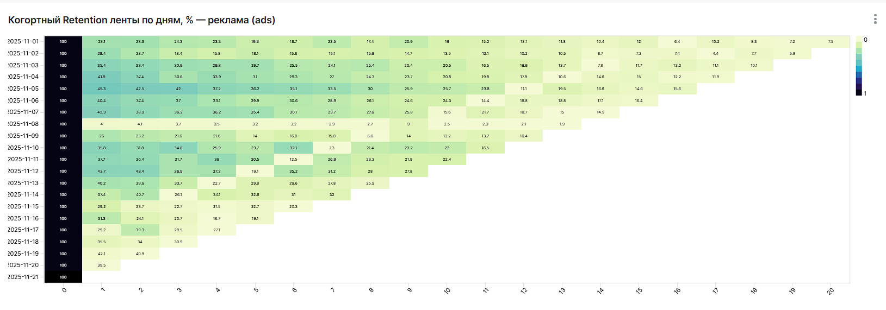
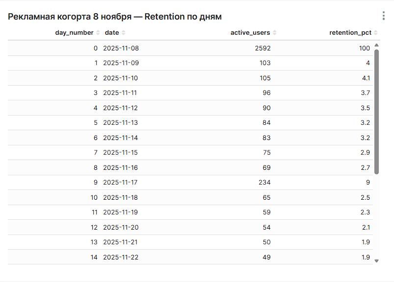
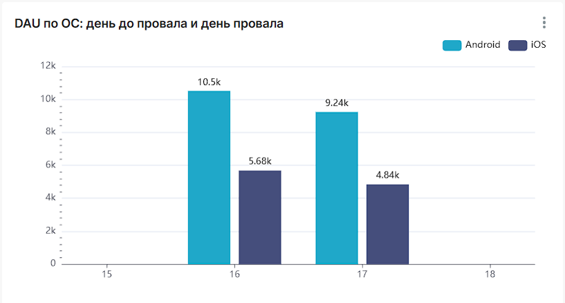
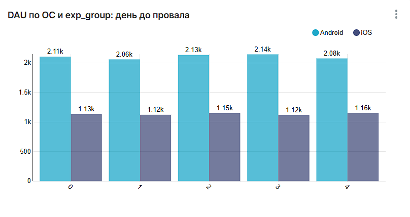
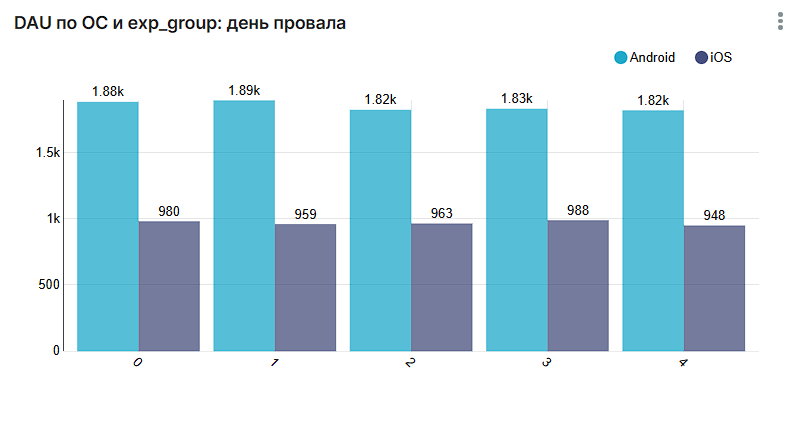
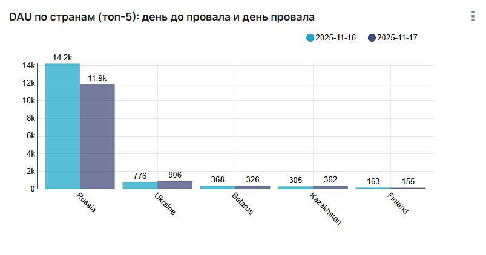

# Feed retention & DAU drop analysis

Анализ удержания пользователей, пришедших по рекламной кампании, и разбор провала DAU в мобильной ленте новостей.  
Стек: **ClickHouse SQL + Apache Superset**.

---

## 🎯 Цели анализа

1. **Ретеншен рекламных пользователей**

   - Что происходит с пользователями, пришедшими через крупную рекламную кампанию?
   - Как быстро они отваливаются, какая доля продолжает пользоваться приложением?

2. **Провал DAU**

   - В один из дней сильно просела дневная аудитория (DAU).
   - Нужно понять, *кто* не смог воспользоваться лентой и *что их объединяет*:
     - операционная система,
     - тестовая группа (`exp_group`),
     - страна / регион,
     - или системная проблема на стороне сервера.

Источник данных — ClickHouse:

- `feed_actions`
- `message_actions`

---

## 📊 Дашборд в Superset

Название дашборда:  
**«3 урок 2 задание. Retention рекламных пользователей и провал DAU»**

### 1. Динамика трафика и эффект кампании

**Графики:**

1. **DAU ленты по дням**  
   Показывает общую дневную аудиторию ленты (уникальные `user_id` по датам).  
   

2. **DAU по источникам (ads vs organic)**  
   Разделение DAU на платный трафик (`source = 'ads'`) и органику (`'organic'`).  
   

**Что видно:**

- Вначале периода DAU растёт за счёт обоих источников.
- **8 ноября** — резкий всплеск по `ads` (масштабная рекламная кампания).
- Через некоторое время видно **однодневный провал DAU**, после которого метрика возвращается к нормальному уровню.

---

### 2. Retention рекламной когорты

Когорта рекламных пользователей:  
пользователи, у которых **первый день в ленте** = `2025-11-08` и `source = 'ads'`.

#### 2.1. Тепловая карта ретеншена

**Чарт:** `Когортный Retention ленты по дням, % — реклама (ads)`  
- X — номер дня жизни когорты (`day_number` = 0, 1, 2, …)  
- Y — дата  
- Метрика — `retention_pct` (доля когорты в %, округление до 0.1)



#### 2.2. Таблица по дням

**Таблица:** `Retention рекламной когорты 8 ноября (ads)`  
Колонки:

- `day_number` — день жизни когорты (0 = 8 ноября),
- `date` — календарная дата,
- `active_users` — активные пользователи в этот день,
- `retention_pct` — их доля от размера когорты, %.



**Наблюдения:**

- Размер рекламной когорты (day 0) ≈ **2592 пользователей**.
- На **1-й день** в ленту возвращается ~**4%** пользователей,
- дальше ретеншен быстро падает до **1–2%** и держится на этом уровне.

---

### 3. Разбор провала DAU

#### 3.1. По операционной системе

**График:** `DAU по ОС: день до провала и день провала`  
Построен из датасета с DAU по `os` (Android / iOS) по дням.



**Числа:**

- **Android:** с ~10.5k до ~9.2k  
- **iOS:** с ~5.7k до ~4.8k  

Падение видно и на **Android**, и на **iOS**, масштаб сопоставим (~12–15%).  
Это не проблема только одной операционной системы или конкретной версии клиента.

---

#### 3.2. По ОС и тестовой группе (exp_group)

Используется датасет `feed_dau_by_os_exp_daily`.

**График 1:** `DAU по ОС и exp_group: день до провала`  


**График 2:** `DAU по ОС и exp_group: день провала`  


**Наблюдения:**

- Внутри **Android** все `exp_group` (0–4) падают примерно одинаково.  
- Внутри **iOS** — та же картина: падение есть у всех групп, и разница по группам небольшая.
- Нет одной «проблемной» группы, у которой DAU обвалилась сильнее остальных.

Вывод: провал DAU вряд ли связан с конкретным экспериментом или раскаткой новой фичи только на часть пользователей.

---

#### 3.3. По странам

**График:** `DAU по странам (топ-5): день до провала и день провала`  
Берём TOP-5 стран по DAU за день до провала, сравниваем DAU этих стран на следующий день.



**Что видно:**

- Основной вклад в падение DAU даёт **Россия** — базовый рынок.  
- Остальные страны (Украина, Беларусь, Казахстан, Финляндия и т.п.) меняются слабо в абсолютных значениях.

Это похоже на **региональную проблему** в ключевой стране (сервер, сеть, локальная инфраструктура), а не на глобальный баг.

---

## 🧠 Основные выводы

### 1. Рекламные пользователи почти не удерживаются

- Рекламная когорта 8 ноября показывает **~4% ретеншена на 1-й день** и быстро падает до **1–2%**.
- Кампания даёт мощный разовый всплеск DAU, но **немного долгоживущих пользователей**.
- Для роста LTV такой трафик малоэффективен без доп. работы с продуктом и онбордингом.

### 2. Провал DAU не связан с конкретной ОС или A/B-тестом

- DAU падает **и на Android, и на iOS** примерно одинаково.
- Внутри каждой ОС просаживаются **все exp_group**.
- Значит, дело не в специфической сборке приложения и не в отдельном эксперименте.

### 3. Сильнее всего пострадал основной регион

- Основное снижение DAU приходится на **Россию**, остальные страны почти не меняются.
- В сочетании с п.2 это больше похоже на **инфраструктурный инцидент в ключевом регионе** (бэкенд / сеть / доступность сервисов), а не на продуктовую гипотезу.

---

## 🛠 Технические детали

- **База данных:** ClickHouse 
- **Инструмент визуализации:** Apache Superset
- **Язык запросов:** SQL (диалект ClickHouse)

Все SQL-запросы, использованные для построения датасетов в Superset, лежат в файле:

```text
sql/lesson3_retention_and_dau_drop.sql
